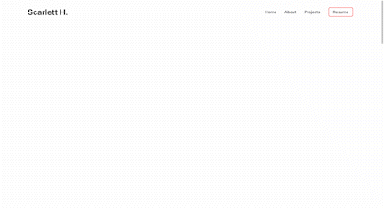
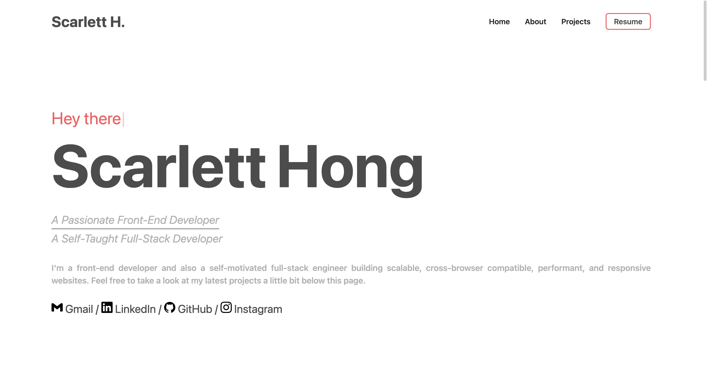

# Portfolio ⚡️ 

## A minimal portfolio template for Developers!

<h2 align="center">
  
  <br>
</h2>

## Features

⚡️ Modern UI Design + Reveal Animations\
⚡️ One Page Layout for most of the content\
⚡️ Clear navigation on different sections\
⚡️ Styled with Tailwind CSS + Bootstrap + Custom SCSS\
⚡️ Fully Responsive


To view the demo: **[click here](https://www.scarletthong.top/)**

---

## Getting Started 🚀

These instructions will get you a copy of the project up and running on your local machine for development and testing purposes. See deployment for notes on how to deploy the project on a live system.

### Prerequisites 📋

You'll need [Git](https://git-scm.com) and [Node.js](https://nodejs.org/en/download/) (which comes with [NPM](http://npmjs.com)) installed on your computer.

```
node@v14.21.2 or higher
npm@6.14.1 or higher
git@2.32.0 or higher
```


---

## How To Use 🔧

From your command line, first clone Simplefolio:

```bash
# Clone the repository
$ git clone https://github.com/honghong1012/Portfolio.git

# Move into the repository
$ cd Portfolio

# Remove the current origin repository
$ git remote remove origin
```

After that, you can install the dependencies using NPM.

Using NPM: Simply run the below commands.

```bash
# Install dependencies
$ npm install

# Start the development server
$ npm start
```

**NOTE**:
If your run into issues installing the dependencies with NPM, use this below command:

```bash
# Install dependencies with all permissions
$ sudo npm install --unsafe-perm=true --allow-root
```

Once your server has started, go to this url `http://localhost:3000/` to see the portfolio locally. It should look like the below screenshot.

<h2 align="center">
  
</h2>

---

## Template Instructions:

### Step 1 - STRUCTURE

For the portfolio is built on Next.js, first go to `/components` and take a look at that:

### (1) Navigation Bar
Navigation bar consists of icons, nav tabs and drop down components for responsive design.
- On `.navbar-icon`, you can put your custom portfolio icon.

```javascript
function Navbar() {
    return (
        <div className="navigation-bar">
            <div className="mx-auto w-11/12 max-w-7xl pt-6 flex items-center justify-between">
                <div className="sduration-300 hover:-translate-y-1 hover:cursor-pointer sm:inline-block">
                    <span className="navbar-icon"><a href="/">Scarlett H.</a></span>
                </div>
                <NavItems />
                <Dropdown />
            </div>
        </div>
    );
}
```

### (2) First Section

The FirstSection component is mainly the component we see when we open the website.

- In `<TypeWriter />`, you can configure different typewriter effect by options, [Click Here](https://github.com/tameemsafi/typewriterjs).
- On `<p>` tag, you can change the slogan on the main page.
- On `<a>` tag, you can change the href to your own social media link.

```javascript
function FirstSection() {
    return (
        <section id="home" className="min-h-screen">
            <main className="calc-height flex w-full items-center py-20">
                <div className="mx-auto flex w-11/12 max-w-7xl items-center justify-between gap-20">
                    <div className="flex w-full cursor-default flex-col gap-3">
                        <div className="hide text-2xl md:text-2xl lg:text-4xl 2xl:text-6xl text-primary-200">
                        <Typewriter
                            options={{
                                strings: ['Hey there', '你好','안녕하세요'],
                                autoStart: true,
                                loop: true,
                            }}
                        />
                        </div>
                        <div className="hide title-name font-bold text-primary-100">
                            <div>Scarlett</div>
                            <div>Hong</div>
                        </div>
                        <p className="hide delay slogan-title italic text-primary-300">
                            A Passionate Front-End Developer
                        </p>
                        <p className="hide delay slogan-title-down italic text-primary-300">
                            A Self-Taught Full-Stack Developer
                        </p>
                        <p className="hide delay text-justify introduction font-semibold text-primary-300">
                            I'm a front-end developer and also a self-motivated full-stack
                            engineer building scalable, cross-browser compatible,
                            performant, and responsive websites.
                            Feel free to take a look at my latest projects a little
                            bit below this page. 
                        </p>
                        <h2 className="hide contact-text text-primary-100">
                            <a href="mailto:honghonghh1012@gmail.com"><Image src={Gmail}/> Gmail</a> / {" "}
                            <a href="https://www.linkedin.com/in/hong-hong-7b283321b/" target="_blank"><Image src={Linkedin}/> LinkedIn</a> / {" "}
                            <a href="https://github.com/honghong1012" target="_blank"><Image src={Github}/> GitHub</a> / {" "}
                            <a href="https://www.instagram.com/scarlett_hong1012/" target="_blank"><Image src={Instagram}/> Instagram </a>  
                        </h2>
                    </div>
                </div>
            </main>
        </section>
    );
}
```


### Step 2 - STYLES

- You can utilize the detailed style by using Tailwind CSS in every element's class. 
- Or you can also go into `/styles/global.css` to customize the your desired styles.

---

## Deployment 📦

Once you finish your setup. You need to put your website online!

I highly recommend to use [Vercel](https://vercel.com) because it is super easy.

## Technologies used 🛠️
- [Bootstrap 5]() - Frontend component library
- [Sass](https://sass-lang.com/documentation) - CSS extension language
- [Next.js]() - 
- [Tailwind CSS]() - 

## Authors

- **Hong Hong** - [honghong1012](https://github.com/honghong1012)
